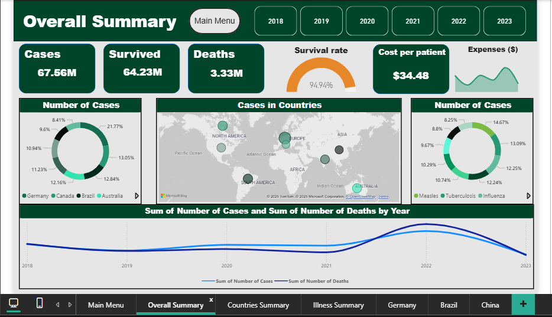

# 📊 Power BI Dashboards

This repository contains interactive dashboards built with **Power BI** for data analysis and visualization.  

---

## 🚀 Projects

### 🛒 Sales Dashboard
- **Description:** Tracks revenue trends, top products, regional KPIs, and month-over-month growth.  
- **Features:** Dynamic filtering, KPI cards, and charts for decision-making.  
- **Screenshots:**  
    

---

### 🏥 Health Dashboard
- **Description:** Analyzes healthcare metrics including patient flow, outcomes, wait times, and department loads.  
- **Features:** Drill-through reports, charts, and slicers for deeper insights.  
- **Screenshots:**  
    
    

---

📩 Questions? Reach out at [Razanserreih03@gmail.com](mailto:Razanserreih03@gmail.com)
